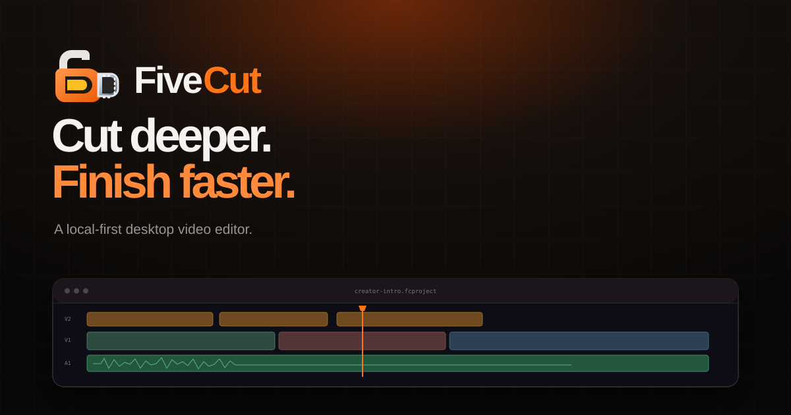

<p align="center">
  <a href="https://5ivesaw.github.io/FiveCut/">
    
  </a>
</p>

<h1 align="center">FiveCut</h1>

<p align="center">
  <strong>Cut deeper. Finish faster.</strong><br>
  A local-first desktop video editor with a deterministic project API for external AI agents.
</p>

<p align="center">
  <a href="https://5ivesaw.github.io/FiveCut/"></a>
  <a href="https://github.com/5ivesaw/FiveCut/releases/latest"></a>
  <a href="https://github.com/5ivesaw/FiveCut/actions/workflows/ci.yml"></a>
  <a href="LICENSE"></a>
</p>

<p align="center">
  <a href="https://github.com/5ivesaw/FiveCut/releases/download/v0.1.0/FiveCut-linux-x64.tar.gz"><strong>Download FiveCut for Linux</strong></a>
  ·
  <a href="https://5ivesaw.github.io/FiveCut/">Visit the website</a>
  ·
  <a href="https://github.com/5ivesaw/FiveCut/issues">Report an issue</a>
</p>

<p align="center">
  <a href="https://5ivesaw.github.io/FiveCut/">
    
  </a>
</p>

> [!IMPORTANT]
> FiveCut is usable today, but it is still an early release—not an Adobe Premiere
> replacement yet. Linux x64 is the currently published desktop build. Windows,
> macOS, and deeper professional workflows are being added through tested releases.

## Why FiveCut

- **Timeline first.** Multi-track video, image, text, graphic, effect, and audio editing
- **Precise.** Frame-accurate trim, split, snap, ripple, keyframes, masks, captions, speed, volume, and blend modes
- **Local by default.** Projects, media, previews, and exports stay on your machine
- **Offline capable.** Editing and built-in creator assets work without the internet
- **Agent ready.** Versioned JSON schemas, hash guards, deterministic commands, validation, logs, rollback, and FFmpeg rendering
- **Open source.** Inspect it, change it, and help shape the editor under the MIT license

## Download and launch

Download [`FiveCut-linux-x64.tar.gz`](https://github.com/5ivesaw/FiveCut/releases/download/v0.1.0/FiveCut-linux-x64.tar.gz), then run:

```bash
tar -xzf FiveCut-linux-x64.tar.gz
cd FiveCut
./fivecut
```

The archive includes its own Electron runtime and local FiveCut server. Run
`./install.sh` only if you also want a `fivecut` terminal command and an
application-menu entry.

Verify the download with the
[published SHA-256 file](https://github.com/5ivesaw/FiveCut/releases/download/v0.1.0/FiveCut-linux-x64.tar.gz.sha256).

## External AI editing

FiveCut does **not** hide an LLM chat service inside the editor. Instead, it
supports two portable workflows:

1. Point a coding agent at a project folder containing your media and
   [`SKILL.md`](SKILL.md). The agent can scan, analyze, validate, edit, render,
   quality-check, and restore through `fivecut-agent`.
2. Ask a file-capable AI website to return a complete `fivecut-project` JSON
   package. Choose **Import AI edit** in FiveCut, select the JSON and referenced
   media, and receive a validated, editable timeline.

The contract lives in [`packages/editor-api`](packages/editor-api). It covers
tracks, clips, trims, captions, effects, keyframes, audio, assets, export
settings, compatibility checks, missing-file handling, and undo-safe command
packages.

```bash
# Inspect media and write machine-readable metadata
bin/fivecut-agent scan . --output .fivecut/media-index.json

# Validate an AI-created project before importing it
bin/fivecut-agent validate ./edit.fivecut.json

# Render and run quality checks deterministically
bin/fivecut-agent render ./edit.fivecut.json --output ./final.mp4
bin/fivecut-agent qc ./edit.fivecut.json
```

See the [agent guide](docs/AI_AGENT_GUIDE.md) and
[command reference](packages/editor-api/README.md) for the complete workflow.

## Privacy and offline behavior

FiveCut requires no account for local editing. The optional Creator Library can
search Openverse for reusable images, music, and sound effects; chosen media is
cached locally. When the network is unavailable, the library falls back to the
built-in backgrounds and sounds.

Set `FIVECUT_OFFLINE=1` to prevent remote catalog searches entirely.

## Build from source

Requirements:

- Bun 1.2.18
- Rust stable with `wasm32-unknown-unknown`
- wasm-pack
- FFmpeg

```bash
bun install --frozen-lockfile
bun run build:wasm
bun run build:web
```

For development:

```bash
bun run dev:web
```

The local editor opens at `http://localhost:3000/projects`.

## Quality gates

Every pull request checks:

- Rust core compilation and tests
- Browser WebAssembly build
- TypeScript type checking and web production build
- Web editor and project-import tests
- Agent contracts, renderer, recovery, and QC tests
- Static download-site structure and local links

Tagged releases build the offline desktop bundle, launch it under a virtual
display, verify the FiveCut Projects screen, create a checksum, and publish the
artifact through GitHub Actions.

## Repository map

| Path | Purpose |
| --- | --- |
| [`apps/web`](apps/web) | Next.js editor interface |
| [`apps/desktop`](apps/desktop) | Secure local desktop shell |
| [`rust`](rust) | Shared editing and media core |
| [`packages/editor-api`](packages/editor-api) | Stable project and command schemas |
| [`tools/fivecut_agent`](tools/fivecut_agent) | Local agent CLI, renderer, analyzer, QC, and recovery |
| [`site`](site) | FiveCut download website |
| [`.github/workflows`](.github/workflows) | CI, releases, and GitHub Pages deployment |

## Roadmap

- Windows and macOS signed desktop packages
- Proxies, scopes, multicam, deeper color, and advanced audio repair
- Automatic transcription, silence cleanup, and highlight/take analysis
- More motion-graphics templates and downloadable creator assets
- Large-project performance, crash recovery, and broader end-to-end testing

Progress is published as working releases rather than hidden behind a hosted
service. Follow the [releases](https://github.com/5ivesaw/FiveCut/releases) and
[issues](https://github.com/5ivesaw/FiveCut/issues).

## Attribution

FiveCut is an independent fork based on
[OpenCut](https://github.com/OpenCut-app/OpenCut). FiveCut and OpenCut are
MIT-licensed. See [NOTICE.md](NOTICE.md) for third-party and asset notices.
